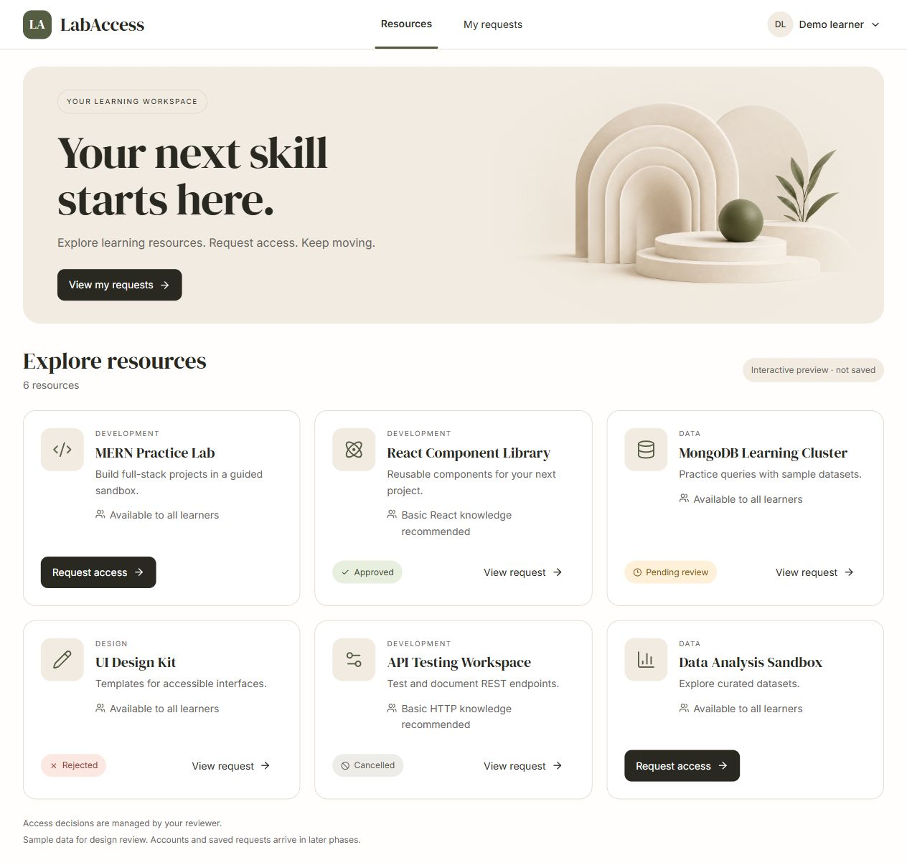

# LabAccess

A MERN learning-resource request and review application. Learners will request resources, reviewers will decide, and both will see persisted history. Approval records a decision; it does not provision external access.

**Current state: Phase 1 design foundation.** The warm resource catalog, six sample resources, status badges, accessible request dialog, and feedback previews are implemented. Requests stay in memory and reset on refresh. Authentication, database-backed resources/workflow, and real seeding are scheduled for later phases. Express readiness remains available at `/api/health`.

Use the demo profile menu → **Preview options** to inspect loading, empty, error, and reviewer variants or simulate a failed submission. My requests and View request show read-only fixture summaries, not completed persisted request pages. Search/category controls are omitted until implemented.



## Prerequisites and install

Use Node **24.14.1 or a later Node 24 release**, npm **11.x** (verified with 11.11.0), and MongoDB locally or Atlas for later persisted features. From the repository root:

```powershell
npm ci
Copy-Item .env.example .env
```

Configure MONGODB_URI in `.env` for your development database. The example points to `mongodb://127.0.0.1:27017/labaccess_dev`. Never commit credentials or `.env`. No local MongoDB service is installed by this repository.

## Commands

```powershell
npm run dev
npm test
npm run build
npm run seed
```

Development: open `http://127.0.0.1:5173`. Vite proxies `/api` to Express on port 3001. Keep PORT=3001 for the supplied proxy; change the proxy alongside it if needed. Stop development with Ctrl+C. Tests use isolated ephemeral HTTP listeners and an intentionally unreachable local database address; they do not delete development data.

`npm run seed` currently fails clearly without changing the database: synthetic accounts/resources arrive in Phase 2. It also refuses NODE_ENV=production. No demo accounts exist yet.

After building, stop development and run the same-origin production server:

```powershell
$env:NODE_ENV = 'production'
npm start
```

Open `http://127.0.0.1:3001`; direct SPA paths return the built client, while `/api` retains JSON responses. Set NODE_ENV back to development before resuming development. This is a local topology check; public HTTPS hosting and secure sessions require later validation.

## Environment

| Variable | Purpose |
|---|---|
| NODE_ENV | development/test/production |
| PORT | API port, default 3001 |
| MONGODB_URI | database connection, never logged |
| DB_CONNECT_TIMEOUT_MS | bounded initial connection wait, default 5000 |
| SESSION_SECRET | reserved for Phase 2; generate a strong random secret before auth |
| SESSION_MAX_AGE_MS | planned session idle lifetime, default 28800000 |
| APP_ORIGIN | planned CSRF allowed browser origin; use actual origin including port |
| SEED_DEMO_PASSWORD | reserved for Phase 2 synthetic accounts |

The API can start without a database, but `/api/health` returns **503** with a controlled failure message. The Phase 1 catalog uses fixtures independently of database readiness. Configure/start MongoDB and restart after an initial failure. Database-backed feature acceptance is still pending.

## Technologies and decisions

React 19, Vite 8, Tailwind 4, customized shadcn/Radix primitives, Motion, Lucide, locally bundled Inter/DM Serif Display fonts, Node 24, Express 5, Mongoose 9, npm workspaces, and Node's built-in test runner. Warm white/beige design, horizontal navigation, feature ownership, server sessions, embedded request history, and conditional revisions are specified in the [architecture](docs/architecture.md) and [API contract](docs/api-contract.md). Sessions and workflow are contracts, not implemented claims.

## AI development experience and evidence

Codex prepared the Phase 0 foundation. Kiro is recommended as the required assessment tool but **has not yet been used**. The email's `app.kiro.de` link differs from official `kiro.dev`; assessment-tool identity remains unresolved. Genuine named-tool tasks and verified outcomes will be recorded in [AI usage](docs/ai-usage.md). No 3–5-task claim is made yet.

See [verification](docs/verification.md) and the [implementation tracker](IMPLEMENTATION_PLAN.md#17-daily-progress-tracking) for actual results and remaining gates. [UI references](docs/UI_REFERENCE_GUIDE.md) are concept images, not working application screenshots. The public repository is [Rishitgoel/LabAccess](https://github.com/Rishitgoel/LabAccess), published on October 8, 2026 at the user's request. The assessment submission has not been emailed; Phase 0's named-tool gates remain open.
