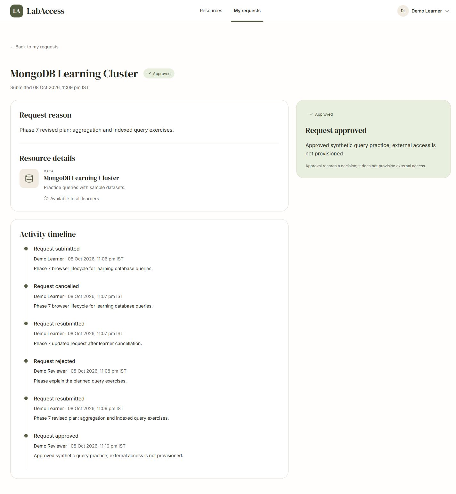

# LabAccess

LabAccess is a MERN application for requesting and reviewing access to learning resources. Learners explain what they need, reviewers record decisions, and both can inspect the saved history. **Approval records a decision inside LabAccess; it does not provision external access.**

The functional workflow and Phase 7 correctness checks are verified locally. Phase 8 clean-checkout validation is in progress; the suite includes a new hidden-checkout SPA regression. Public hosting, full-motion visual acceptance, genuine Code0/Kiro task evidence, and developer explanation acceptance remain open. See [verification](docs/verification.md) for the scope of each result.



## Features

- Register as a learner, sign in/out, and restore a session after refresh.
- Browse six seeded resources with descriptions, categories, and eligibility guidance.
- Request access with a reason; view your own requests and history.
- Cancel a pending request; update and resubmit a rejected or cancelled request.
- Review all learner requests, approve/reject with a reason and confirmation, and inspect previous events.
- Filter by All/Pending/Approved/Rejected/Cancelled and paginate lists.
- Responsive layouts, labelled fields, keyboard/focus handling, reduced motion, and useful loading/empty/error states.
- Saved-state reconciliation for uncertain writes; stale revisions cannot silently replace a newer decision.

Reviewers cannot submit learner requests. Learners cannot open another learner's request or reviewer routes. Public registration has no role picker and never creates reviewers.

## Technologies

MongoDB, Express 5, React 19 and Node 24 provide the MERN stack. Mongoose 9 defines schemas and indexes; express-session/connect-mongo stores sessions; Argon2id hashes passwords. The client uses Vite 8, React Router 7, Tailwind 4, shadcn/Radix primitives, Motion, Lucide and locally bundled fonts. JavaScript ES modules and npm workspaces share one committed lockfile. Tests use Node's test runner, Supertest and genuine isolated mongod processes through mongodb-memory-server. No AI service is required to run the application.

## Prerequisites

- Git for cloning.
- Node **24.14.1 or later in the Node 24 line** (`>=24.14.1 <25`).
- npm **11.x** (`>=11 <12`); tested with **11.11.0**.
- A local MongoDB deployment or Atlas connection. The supplied development helper is an alternative if MongoDB is not installed.
- Internet access for `npm ci`, npm audit, and the first MongoDB binary download used by the helper/tests. Later runs can use the machine's cached binary.

Windows/PowerShell is the verified environment. Other operating systems are not claimed as tested. The API binds to `127.0.0.1`; port 3001, Vite port 5173, and the optional MongoDB helper's port 27017 must be free. Stop another copy before following these default commands; do not terminate an unrelated MongoDB service. If MongoDB already runs locally, use it and skip the helper.

## Installation and configuration

Run in PowerShell:

```powershell
git clone https://github.com/Rishitgoel/LabAccess.git
Set-Location LabAccess
node --version
npm --version
npm ci
Copy-Item .env.example .env
node -e "console.log(require('node:crypto').randomBytes(32).toString('hex'))"
```

Edit the root `.env`: set `SESSION_SECRET` to the generated random value and `SEED_DEMO_PASSWORD` to a **synthetic** password of 12–128 characters. Quote values containing spaces or `#`, for example `SEED_DEMO_PASSWORD="LabAccess Demo 2026!"`. This example is intentionally public; do not reuse a real password. Never commit `.env` or print a private MongoDB URI in screenshots.

The defaults use `MONGODB_URI=mongodb://127.0.0.1:27017/labaccess_dev` and `APP_ORIGIN=http://127.0.0.1:5173`. Use **127.0.0.1**, not an interchangeable browser hostname: origin checks include scheme, hostname and port. For an isolated check you may use `labaccess_test_your_suffix` as the database name. Seed accepts only `labaccess_dev`, `labaccess_test`, or `labaccess_test_...` and refuses production.

### Database choices

**Local MongoDB:** keep your service running and point `MONGODB_URI` to the dedicated demo/test database. Do not use an employer or production database.

**Development helper:** if no MongoDB is running, open a second terminal in this repository and run:

```powershell
npm run mongo
```

Wait for `Development MongoDB listening on 127.0.0.1:27017`. This runs a genuine standalone mongod and preserves this checkout's data in ignored `.local/mongodb` across restarts. It installs no system service. Stop with Ctrl+C; there is no destructive reset command. The helper is for development, not hosting.

**Atlas:** create a dedicated demo database, allow only the needed client IP, and use a database user scoped to that database. Set the Atlas connection string in `.env` with a supported seed database name. Encode reserved characters in credentials. Follow the official [Atlas connection guide](https://www.mongodb.com/docs/atlas/connect-to-database-deployment/). Keep the URI outside Git. The Atlas setup is an alternative; the verification ledger uses local MongoDB and does not claim a live Atlas test.

### Seed and development server

With MongoDB running, use another terminal in the repository root:

```powershell
npm run seed
npm run dev
```

Wait for `Database connected` and Vite's ready message. Open [http://127.0.0.1:5173](http://127.0.0.1:5173). Vite forwards `/api` to Express on 3001; **keep PORT=3001** for this configuration. Stop the development process with Ctrl+C before using the built-client start command.

| Synthetic account | Role |
|---|---|
| learner@labaccess.test | Learner |
| learner2@labaccess.test | Learner |
| reviewer@labaccess.test | Reviewer |

All three use your `SEED_DEMO_PASSWORD`. Seed inserts accounts and six resources with insert-only upserts. Repeating it preserves IDs, records and existing passwords; changing the seed password **does not reset accounts**. Registration creates a learner and does not automatically sign in.

## Demo walkthrough

1. Sign in as `learner@labaccess.test`. On MongoDB Learning Cluster, choose **Request access**, enter a reason of 20–1,000 Unicode code points, and submit. Open **My requests** and then the details. Reload to see the persisted pending request and its first event.
2. Choose **Cancel request** and confirm; update the reason and choose **Resubmit request**. The original submission and cancellation remain in history.
3. Sign out using the profile menu. Sign in as `reviewer@labaccess.test`, open **Review queue** (Pending by default), and open the same request. Enter a decision reason of 10–500 code points, choose **Reject request**, and confirm.
4. Sign out and return as the first learner. Read the feedback, enter an updated reason, and resubmit.
5. Return as the reviewer and approve with a reason and confirmation. The owner's next sign-in/reload shows Approved and all six events. Approved requests have no cancellation, resubmission or further decision controls.
6. Sign in as `learner2@labaccess.test`. Its list is separate; the first learner's detail URL returns a neutral not-found page. A learner visiting `/review` sees Access denied.

Use status filters and pagination as your synthetic data grows. A short or overlong reason shows a field error. If a save cannot be confirmed, the UI retains the draft and requires **Check saved state** before another action. A concurrent change refreshes the saved request and requires reviewing it before acting again.

## Test, build and run the built client

From the repository root:

```powershell
npm test
npm run build
npm audit
```

Tests use separate disposable real MongoDB instances, not the configured development database. They cover sessions/CSRF, role/ownership isolation, unique indexes, validation, transitions/history, concurrent writes, filters/paging and write recovery. The first test run may download mongod. There are 16 client and 41 backend checks, including a hidden-checkout built-SPA regression; a real server child process also verifies startup and persistence. The current build succeeds with a non-failing >500 kB main-chunk advisory.

For a **local built-client check**, stop `npm run dev`, edit `.env` to `APP_ORIGIN=http://127.0.0.1:3001` while leaving `NODE_ENV=development`, then run:

```powershell
npm start
```

Open [http://127.0.0.1:3001](http://127.0.0.1:3001). Express serves `client/dist` and the API from one origin; detail-page reloads work through its SPA fallback. Stop with Ctrl+C. Restore `APP_ORIGIN=http://127.0.0.1:5173` before returning to `npm run dev`. These HTTP checks do not claim production HTTPS acceptance.

For an alternate built-client port, set `PORT=3002` and `APP_ORIGIN=http://127.0.0.1:3002`, then use `npm start` and that URL. Restore `PORT=3001` as well as the Vite origin before `npm run dev`. The Codex in-app browser blocked port 3001 navigation in the Phase 8 environment; default-port HTTP/API checks and the alternate-port browser check are recorded separately.

### Production configuration

Build the client, set `NODE_ENV=production`, configure a strong independent `SESSION_SECRET`, MongoDB, and the exact external HTTPS `APP_ORIGIN`, then run `npm start` behind a same-host TLS reverse proxy. Secure cookies require HTTPS. The server remains loopback-only; it is not a public listener or TLS terminator.

Set `TRUST_PROXY=loopback` **only** when that proxy overwrites `X-Forwarded-For`, `X-Forwarded-Host` and `X-Forwarded-Proto`; keep the backend isolated from public access. Trust defaults off and broader settings are rejected. Seed refuses production: configure reviewers/resources in a controlled development/test setup rather than advertising a production seed. Production deployment, certificate management and hosted browser acceptance remain operator work, not a one-command hosting claim. The local TLS proxy/API topology was verified with a test CA explicitly trusted only by the verification client.

## Environment variables

The server and seed load the repository-root `.env`. Existing process environment values take precedence; check stale shell overrides if configuration appears ignored. The `mongo` helper does not load `.env` and runs at its fixed development defaults.

| Variable | Default / purpose |
|---|---|
| NODE_ENV | `development`; also accepts `test` or `production` |
| PORT | `3001`; keep it for the supplied Vite proxy |
| MONGODB_URI | Example points to local `labaccess_dev`; required for persistence; never committed |
| DB_CONNECT_TIMEOUT_MS | `5000`; integer 100–30,000; bounded initial connection wait |
| SESSION_SECRET | No usable default; required, at least 32 characters; generate a random value |
| SESSION_MAX_AGE_MS | `28800000` (8 hours); rolling idle lifetime, 1 minute–7 days |
| APP_ORIGIN | `http://127.0.0.1:5173`; exact allowed mutation origin; HTTPS required in production |
| TRUST_PROXY | `false`; only alternative is `loopback` for the documented same-host TLS proxy |
| SEED_DEMO_PASSWORD | No usable default; synthetic 12–128-character password; seed only |

Health is [GET /api/health](http://127.0.0.1:3001/api/health). Configured API routes return 503 when persistence is not ready. An initial connection/index failure requires restarting after fixing MongoDB. An established connection can reconnect after a later outage. Errors omit stack traces, credentials, hashes and session internals.

## Architecture and tradeoffs

One React client and one modular Express application share MongoDB. Auth owns accounts/sessions; resources owns catalog availability; requests owns submissions, transitions and history. Pages compose feature hooks and pure UI components. Controllers validate HTTP input; services enforce permissions and transitions; models define persistence and indexes.

- MongoDB sessions hold user ID and a synchronizer CSRF token. Protected calls read the current account role from the database. Login rotates the session/token; logout destroys the session. No login state is stored in localStorage. Cookies are HttpOnly/SameSite=Lax, and Secure in production. Every mutation also verifies Origin/Referer and the CSRF token.
- One request document per learner/resource is protected by a unique compound index. History is embedded in that document so each update can set status, increment revision and append its actor/reason/time event atomically. A conditional write checks the displayed revision and allowed previous state; a stale action gets 409. Resubmission rechecks resource availability and preserves earlier events.
- Embedded history avoids multi-document transactions for this bounded workflow, but long-lived histories can grow. Current projections show current actor/resource names alongside stable stored IDs; historical names are not snapshotted.
- The client sends a mutation once and reconciles uncertain responses with a saved-state read. It retains matching data during refresh and blocks another action while state is unknown. It has no offline mutation queue or real-time subscription.
- Authentication throttling is 20 attempts/IP/15 minutes in this single process. Multiple instances would need a shared limiter and an operational deployment design.

Details: [architecture](docs/architecture.md), [API contract](docs/api-contract.md), [developer walkthrough](docs/developer-walkthrough.md), [verification](docs/verification.md).

## AI Development Experience

**Required named tool: Code0 or Kiro. Verified completed named-tool tasks: zero.** Kiro was recommended, but signed-in use and the assessment email's tool-domain identity remain unresolved. Codex developed and checked this repository; it does not satisfy that named-tool requirement. No 3–5-task compliance claim is made.

Five real **Codex** task examples, accepted/corrected suggestions, actual issues, verification and commit links are recorded in [AI usage evidence](docs/ai-usage.md). They are explicitly separate from the pending Code0/Kiro evidence. Installation, an account, a prepared prompt or tests suggested by Codex must not be presented as a completed Kiro task.

## Screenshots and known limitations

Actual synthetic-data application captures: [approved desktop](docs/screenshots/phase7/approved-1440.png), [approved mobile](docs/screenshots/phase7/approved-375.png), [stale decision](docs/screenshots/phase7/stale-decision.png), [uncertain save](docs/screenshots/phase7/uncertain-write.png), [learner list](docs/screenshots/phase6/05-my-requests-1440.png), [review queue](docs/screenshots/phase6/08-review-queue-1440.png), and [login](docs/screenshots/phase6/02-login-1440.png).

`docs/ui-references` and `sample-ui.png` are **design concepts**, not application screenshots. `/preview` is an explicitly unsaved design demo and is not persistence evidence.

Optional search/category controls, count summaries and a hosted demo are omitted. Payments, notifications, password reset, uploads, external provisioning, role/resource management, multiple organizations and real-time updates are outside scope. No public HTTPS workflow or live Atlas run is claimed. The tested browser has reduced motion enabled; full-motion smoothness remains unverified. Genuine named-tool tasks and the developer's independent explanation remain human acceptance gates.

[Implementation tracker](IMPLEMENTATION_PLAN.md#17-daily-progress-tracking) · [Public repository](https://github.com/Rishitgoel/LabAccess). Assessment submission has not been emailed.
