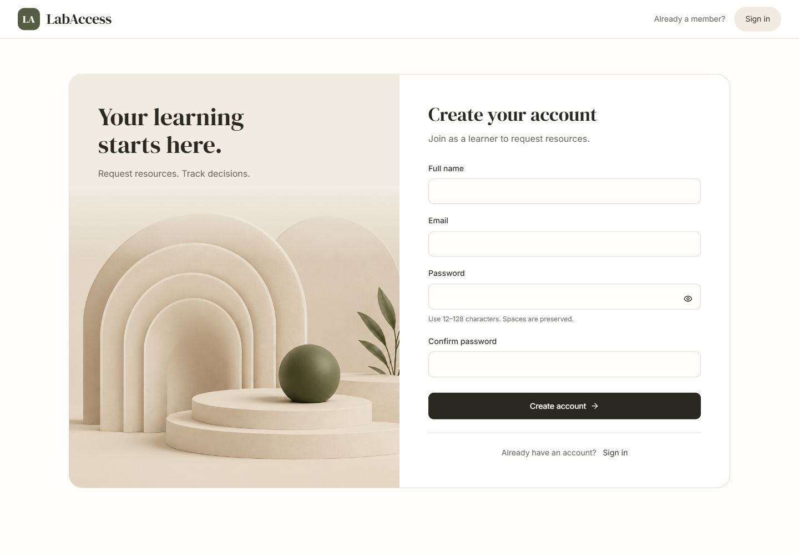

# LabAccess

A MERN learning-resource request and review application. Approval records a decision; it does not provision external access.

**Current state: Phase 2 verified locally.** Registration, login/logout, MongoDB sessions, role guards, CSRF protection, and the database-backed resource catalog are implemented. Request submission, review, and history arrive in Phases 3–5. The normal app uses MongoDB; `/preview` preserves the Phase 1 fixture demonstration and clearly labels its unsaved behavior.



## Setup

Use Node **24.14.1 or a later Node 24 release**, npm **11.x** (verified 11.11.0), and MongoDB locally or Atlas.

```powershell
npm ci
Copy-Item .env.example .env
node -e "console.log(require('node:crypto').randomBytes(32).toString('hex'))"
```

Copy the generated random value into `SESSION_SECRET` in `.env`. Set `SEED_DEMO_PASSWORD` to a synthetic password of 12–128 characters; quote it if it includes spaces or `#`. Never use a real password for demo accounts or commit `.env`.

The supplied development origin is `http://127.0.0.1:5173`. Use that exact address in the browser; `APP_ORIGIN` includes the scheme and port. Set `MONGODB_URI` to a dedicated demo database named `labaccess_dev` or `labaccess_test[_suffix]` if using the seed.

If MongoDB is not installed, start the development helper in a separate terminal:

```powershell
npm run mongo
```

This downloads a genuine MongoDB binary through mongodb-memory-server and runs it on loopback port 27017. It preserves data in ignored `.local/mongodb` across restarts. It installs no system service and refuses production. Use a normal supported MongoDB deployment for hosting. Initial binary download requires internet access; tests also use this cached binary.

Then, in another terminal:

```powershell
npm run seed
npm run dev
```

Open [the app](http://127.0.0.1:5173). Vite proxies `/api` to Express on port 3001. Keep PORT=3001 for this proxy. Stop each terminal process with Ctrl+C.

## Synthetic accounts

| Email | Role |
|---|---|
| learner@labaccess.test | Learner |
| learner2@labaccess.test | Learner |
| reviewer@labaccess.test | Reviewer |

All three use your configured `SEED_DEMO_PASSWORD`. Public registration always creates a learner and does not automatically sign in. There is no role picker. The seed inserts six resources and these accounts using insert-only upserts; repeated runs preserve IDs, existing records, and existing passwords. Changing the configured seed password does **not** reset existing accounts. There is no destructive reset command. Seed refuses production, non-demo database names, and missing/invalid demo passwords before connecting.

## Verification and build

```powershell
npm test
npm run build
npm audit
```

The 19 checks include real MongoDB indexes, concurrent normalized-email registration, cookie/session expiry, regeneration/logout replay, trusted role changes, CSRF/origin rejection, resource pagination, rate limiting, seed guards, and unavailable-database recovery boundaries. Integration tests launch an isolated disposable database and never delete the development database. Browser evidence covers proxy login/registration, refresh, logout, learner/reviewer routes, database restart recovery, and 1440/768/375px layouts. See [verification](docs/verification.md).

For a local same-origin built-client check, run `npm start` after building while retaining development settings; open `http://127.0.0.1:3001` and set `APP_ORIGIN` to that exact origin first. Restore the Vite origin when returning to `npm run dev`.

Production requires `NODE_ENV=production`, an HTTPS `APP_ORIGIN`, a strong `SESSION_SECRET`, MongoDB, and a built client. Cookies are Secure in production. TLS termination, public binding, and narrowly scoped trust-proxy configuration must be established and verified during hosting; the current server listens on loopback and trusts no proxy. Plain HTTP is insufficient for production login. Public HTTPS deployment has not been verified.

## Environment

| Variable | Purpose |
|---|---|
| NODE_ENV | development/test/production |
| PORT | API port, default 3001 |
| MONGODB_URI | Database connection, never logged |
| DB_CONNECT_TIMEOUT_MS | Bounded selection wait, default 5000 |
| SESSION_SECRET | Required random secret, at least 32 characters |
| SESSION_MAX_AGE_MS | Rolling idle lifetime, default 8 hours; 1 minute–7 days |
| APP_ORIGIN | Exact allowed mutation origin; HTTPS in production |
| SEED_DEMO_PASSWORD | Synthetic demo password, 12–128 characters |

Health and configured feature routes return **503** when database readiness fails. An initial connection/index failure requires a server restart after fixing MongoDB. A later outage hides private content on session bootstrap; retry recovers after the established connection reconnects. API errors omit credentials, hashes, and session internals.

## Architecture

React 19, Vite 8, Tailwind 4, shadcn/Radix, Motion, Lucide, locally bundled fonts, Node 24, Express 5, Mongoose 9, express-session/connect-mongo, Argon2id, React Router, and npm workspaces. Sessions hold user ID and a CSRF token; protected calls load the current account role. No login state is saved to localStorage. Every mutation requires a synchronizer token and verified Origin/Referer. Login regenerates the session and rotates the token; logout destroys it. Authentication attempts are limited to 20 per IP per 15 minutes in this single-process application. See [architecture](docs/architecture.md) and [API contract](docs/api-contract.md).

## AI development and outstanding gates

Codex implemented the foundations and Phases 1–2. Kiro is recommended but **has not yet been used**. The email's `app.kiro.de` differs from official `kiro.dev`; assessment-tool identity is unresolved. Phase 0 remains open for identity clarification and a genuine named-tool task. [AI usage](docs/ai-usage.md) contains the prepared task; no 3–5-task claim is made.

[Implementation tracker](IMPLEMENTATION_PLAN.md#17-daily-progress-tracking), [UI reference guide](docs/UI_REFERENCE_GUIDE.md), and [public repository](https://github.com/Rishitgoel/LabAccess). Concept images are not implementation screenshots. Assessment submission has not been emailed.
