# LabAccess — Page Reference Guide

**Theme:** warm white, beige, charcoal, and olive.  
**Status:** static design references, not screenshots of an implemented application.  
**Roadmap:** [IMPLEMENTATION_PLAN.md](../IMPLEMENTATION_PLAN.md).  
**Design tokens and motion:** [DESIGN.md](../DESIGN.md).  
**Product behavior:** [PRD.md](../PRD.md).

## How to use these references

Before implementing or changing a page, open its image and the relevant roadmap phase. Match composition, spacing rhythm, color roles, navigation, cards, forms, and action placement. Reuse shared components. Compare a browser screenshot afterward.

PRD.md defines behavior; DESIGN.md defines exact tokens, typography, accessibility, responsiveness, and motion. Generated images guide composition. If sample text, character counts, display IDs, or oversized headings differ from the written specification, follow the written specification and real data. Do not create new features just because a decorative detail appears.

The original sample-ui.png remains the theme source. 01-resources.png is a copy. Earlier indigo/sidebar concepts are superseded. Other images are generated from that warm reference.

## Page-to-phase map

For a browser gallery, open [ui-references/index.html](ui-references/index.html). Click an image to view it at full size.

| Image | Page/state | Main phases |
|---|---|---|
| [01-resources.png](ui-references/01-resources.png) | Resource catalog | 1 and 4 |
| [02-login.png](ui-references/02-login.png) | Login | 2 |
| [03-registration.png](ui-references/03-registration.png) | Registration | 2 |
| [04-request-dialog.png](ui-references/04-request-dialog.png) | Request access dialog | 1 and 4 |
| [05-my-requests.png](ui-references/05-my-requests.png) | My requests | 4 and 5 |
| [06-learner-pending.png](ui-references/06-learner-pending.png) | Learner request details — pending | 4 and 5 |
| [07-learner-resubmit.png](ui-references/07-learner-resubmit.png) | Learner request details — rejected/resubmit | 5 |
| [08-review-queue.png](ui-references/08-review-queue.png) | Reviewer queue | 4 and 5 |
| [09-reviewer-decision.png](ui-references/09-reviewer-decision.png) | Reviewer request details — decision | 4 |
| [10-learner-approved.png](ui-references/10-learner-approved.png) | Learner request details — approved | 4 and 5 |
| [11-access-denied.png](ui-references/11-access-denied.png) | Access denied | 4 and 7 |
| [12-not-found.png](ui-references/12-not-found.png) | Page or request not found | 4 and 7 |

## Shared components and variants

- One AppHeader with public, learner, and reviewer navigation variants.
- One AuthLayout for login and registration.
- One StatusBadge with text/icons for all states.
- One RequestDetails page with role/status-driven action panels, not separate duplicate implementations per image.
- Shared PageHeading, Card, Input, Textarea, Dialog, filters, pagination, timeline, and feedback components.
- Cancelled/resubmission and post-decision reviewer screens are variants of the reference layouts, not new product modules.
- Sample LA-102/103/104 labels are illustrative. Use a display of the existing request ID or omit the label; a separate public-ID system is not required.

## State coverage without new page designs

| State | Guidance |
|---|---|
| Loading | Skeleton matching the page's final layout; avoid major layout shifts |
| Empty list/filter | Keep header/filters; replace rows with a useful EmptyState |
| Read failure | Keep shell; ErrorState with retry |
| Mutation in progress | Keep content, disable controls, retain field text |
| Validation error | Label-associated message beneath the affected field |
| Stale decision | Explain conflict, refresh saved status, require deliberate new action |
| Uncertain write | Reconcile server state before another attempt |
| Cancel confirmation | Shared ConfirmDialog; outline secondary action and clear destructive action |
| Approve/reject confirmation | Shared ConfirmDialog summarizing action and reason |
| Session expired | Public auth screen with safe recovery; no prior private data visible |

## Responsive and motion guidance

Desktop images are composition references. At 768px reduce grid columns and detail spacing; around 375px stack content/cards and collapse navigation accessibly. Keep actions and labels reachable. Use DESIGN.md's font sizes rather than shrinking the desktop screenshot.

Images cannot demonstrate animation. Implement the shared Motion presets in DESIGN.md, honor reduced motion, and verify by interacting with the actual app. Do not add unrequested perpetual loops or motion that delays forms.

## Visual completion gate

Before marking a UI phase complete:

- [ ] Open the relevant reference image(s).
- [ ] Use shared tokens/primitives and correct role navigation.
- [ ] Match page hierarchy, content grouping, and action placement.
- [ ] Render real saved state and permitted actions.
- [ ] Check desktop/tablet/mobile screenshots and record meaningful differences.
- [ ] Check keyboard/focus, contrast, error/empty/loading, and reduced motion.
- [ ] Avoid nonfunctional controls and unintended feature additions.
- [ ] Preserve business correctness when visual references and mock data differ.

## Reference gallery

### Resource catalog

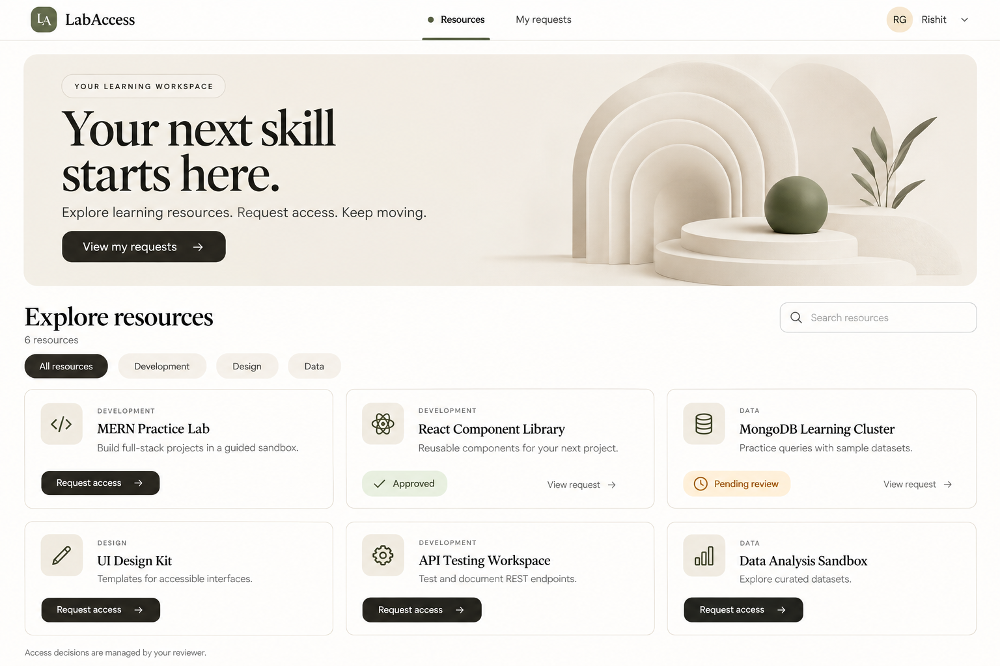

Primary theme reference. Learner catalog with hero, three-column cards, and current request status. Reviewer variant reuses the catalog but hides learner-only request controls; show Review queue instead of My requests and adapt the hero link. Search/category controls remain optional.

### Login

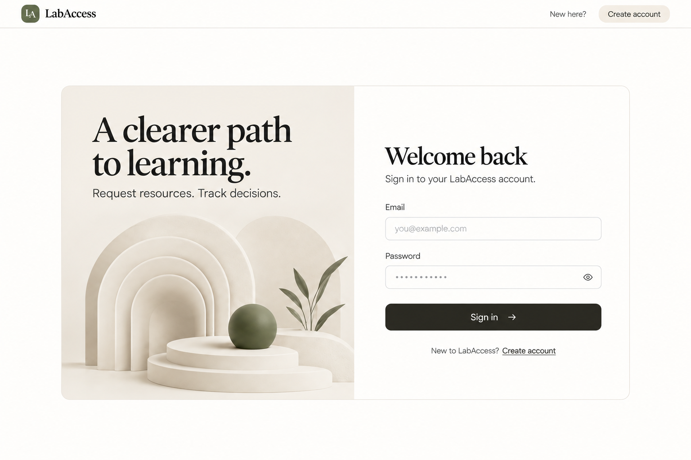

Public login; no authenticated navigation, role selector, or social providers. Use the same AuthLayout as registration.

### Registration

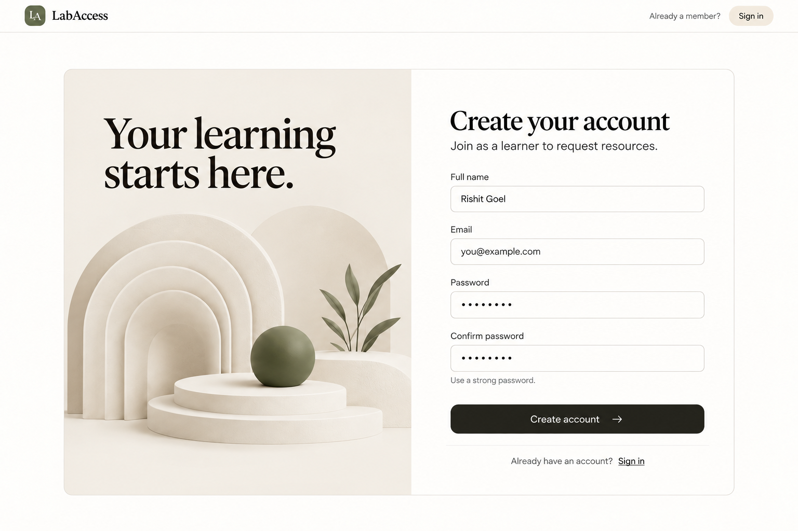

Public learner signup; no role selector. Confirm password is client-side confirmation only; do not add an unnecessary persisted field.

### Request access dialog

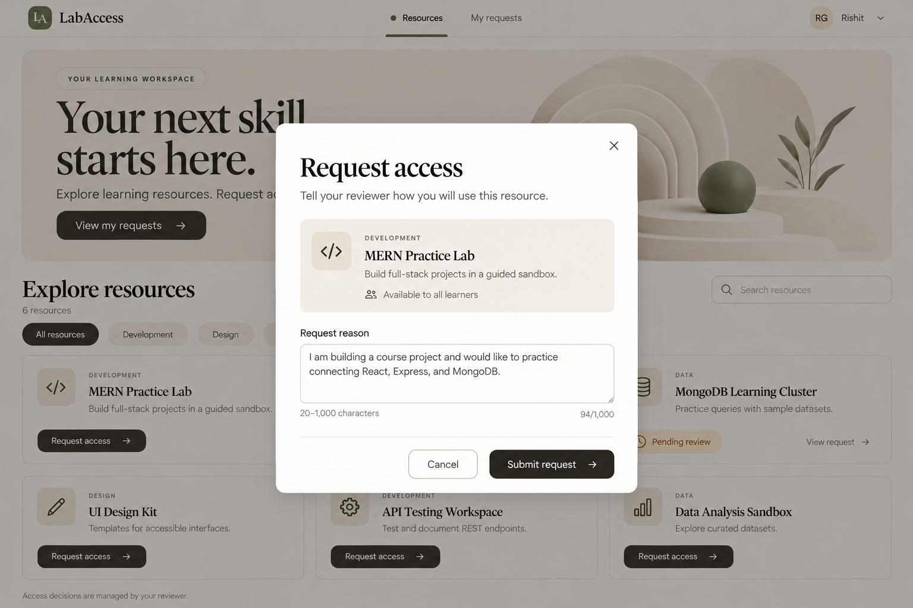

Request form overlay on the catalog. Preserve reason on errors, disable during submit, and calculate the actual character count. Background content is inert while the dialog is open.

### My requests

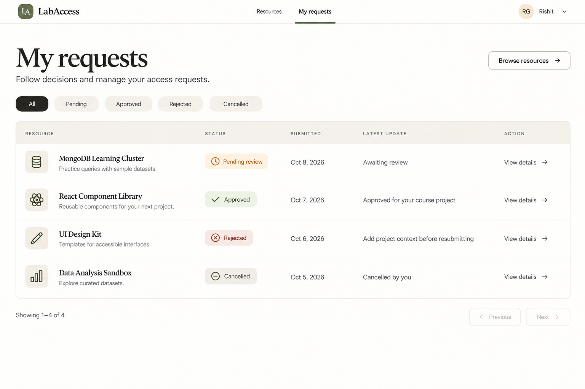

Learner-only request list with status filters and pagination. View details is the row action. Use a compact reusable PageHeading even if the generated image exaggerates heading size.

### Learner request details — pending

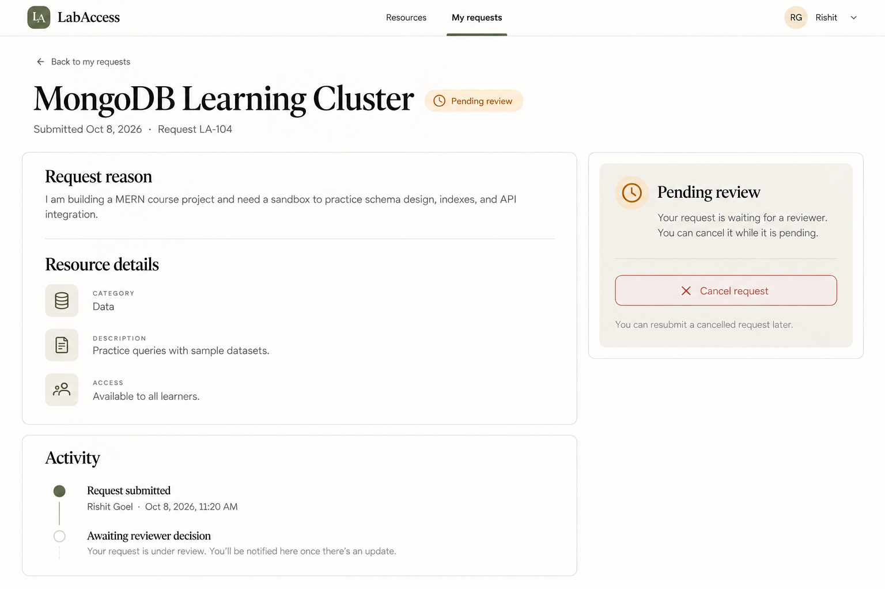

Owner's pending details: context/history and cancel action. Show confirmation before cancellation. Awaiting review is a current-state indicator, not a persisted audit event. The copy does not imply email, push notifications, or real-time delivery.

### Learner request details — rejected/resubmit

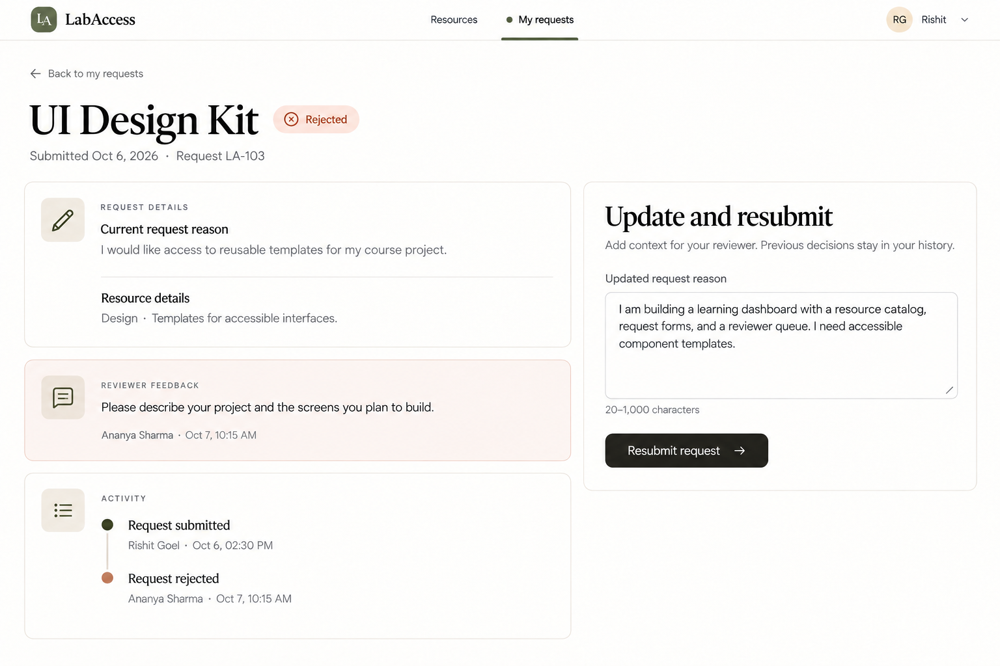

Rejected request with reviewer feedback and an updated reason form. Reuse the same page/component for cancelled requests using the Cancelled badge and cancellation context; omit reviewer-feedback content when none exists.

### Reviewer queue

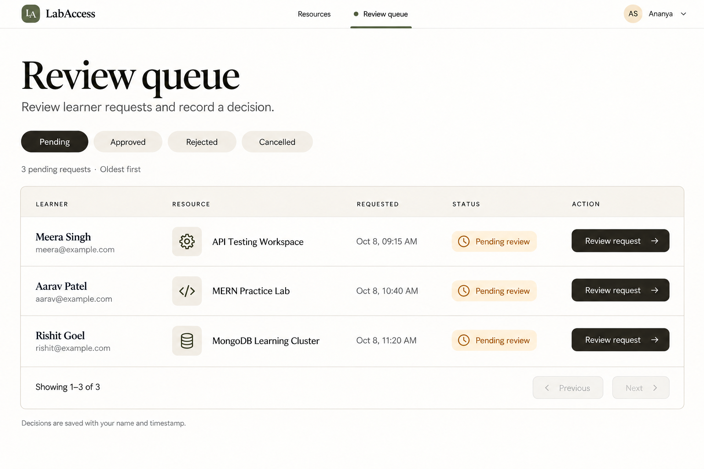

Reviewer-only queue, pending oldest first. No inline approvals or learner submission buttons. Reuse list/filter/pagination primitives rather than copying the learner table's business logic.

### Reviewer request details — decision

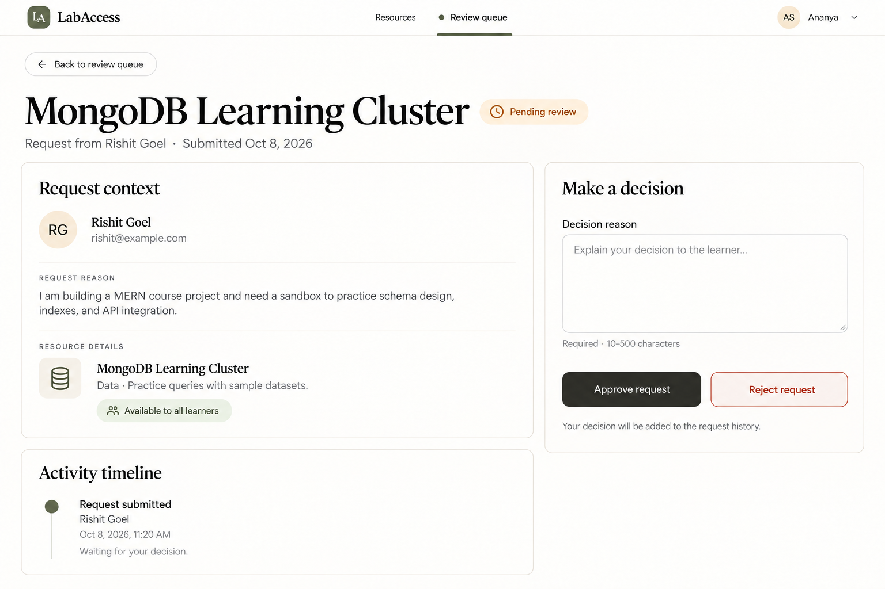

Reviewer-only pending detail: learner context, history, decision reason, approve/reject. Require confirmation and valid reason. After a decision, hide write controls and show read-only decision context.

### Learner request details — approved

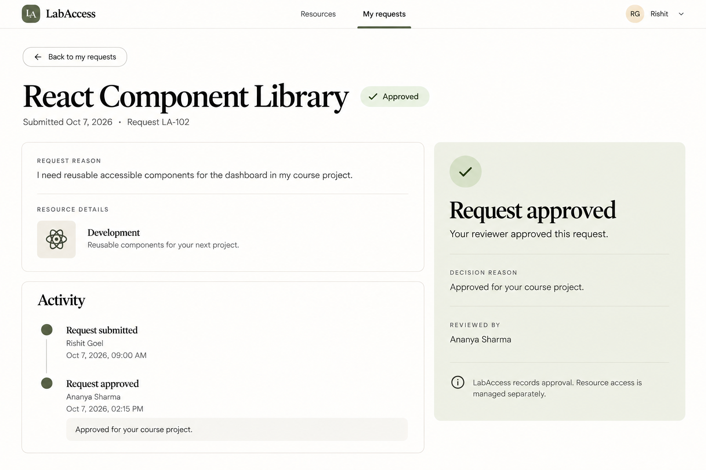

Terminal approval, readable reason/history, no cancellation/resubmission or launch-resource button. Approval records a decision and does not provision access.

### Access denied

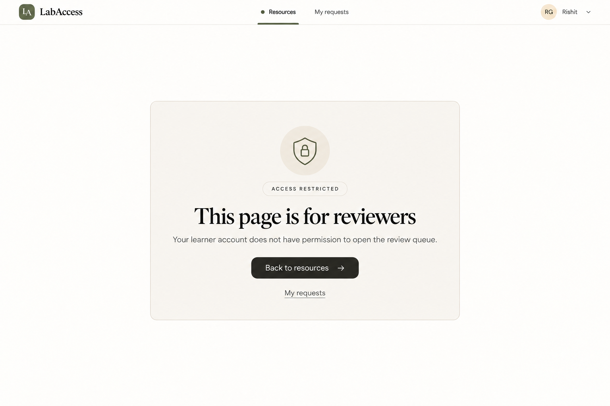

Role-forbidden route only. Never use this screen to reveal another learner's ownership or request existence; unauthorized request IDs use the neutral not-found response.

### Page or request not found

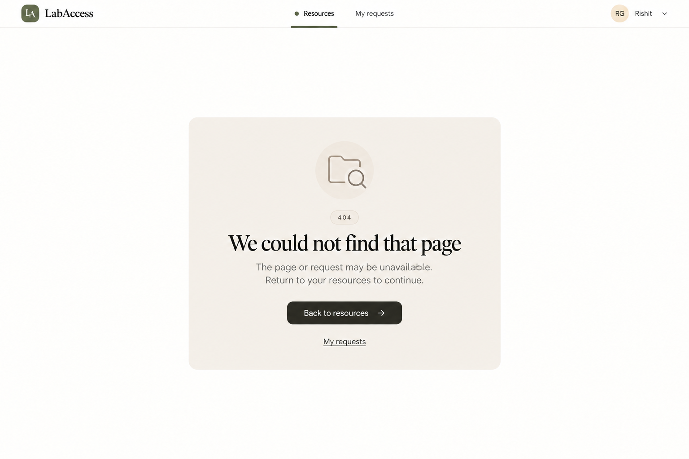

Unknown route or missing/inaccessible request. Signed-out variant uses the public header and a Sign in recovery action instead of assuming an authenticated profile.

## Generation provenance

Eleven new images were generated with the built-in image tool using the original catalog as a visual reference. One existing catalog image was copied unchanged. Exact generation prompts are saved in [UI_REFERENCE_PROMPTS.md](UI_REFERENCE_PROMPTS.md).
